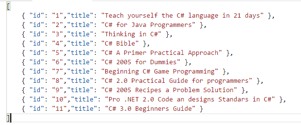
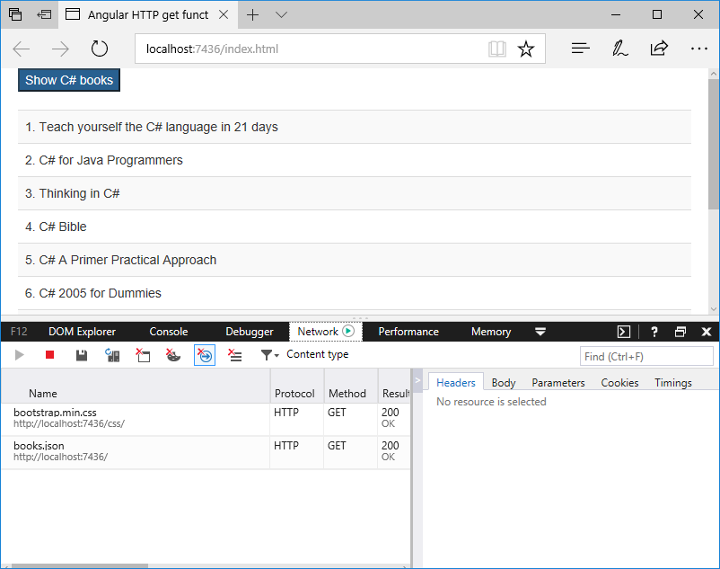

# Fetching JSON Data with Angular $http.get() function.
        

            Angular has built-in support for communication with remote HTTP servers and includes some low-level methods of fetching and posting the data. Angular comes with the $http service which includes a few methods we can utilize with all verbs of the REST protocol.
        

        

            We'll look at a example using the .$http.get() request. The $http.get() method accepts two parameters: URL and config object.
        

        

                The first parameter URL is always required and the config is optional, the shortcut $http.get() method initiates a GET request to the server to retrieve data from the server.
                This example has the following files: 
                <ul>
                    <li><b>books.js</b>: it contains the data in JSON format.</li>
                    <li><b>app.js</b>: it contains the functional logic for the example</li>
                    <li><b>getexample.html</b>: contains the front for the example</li>
                </ul>
        

        
<b>Fig.1. The source code for the JSON file</b>
 
        

        
        
 
        

        In the previous example the controller defines a dependency to the <i>$scope</i> and the <i>$http</i> module. An HTTP GET request to the data “books.json” endpoint is carried out with the get method. It returns a $promise object with a success and error method.
        

        
<b>Fig 2. Running the example</b>
 
        

        

 
        

        If you open the web page up in your browser, you'll see a standard HTML button created, when you press the button the <i>$http</i> service makes an ajax call and set response to the scope's property books. Thus books can be used to draw a list in the HTML page.
        

